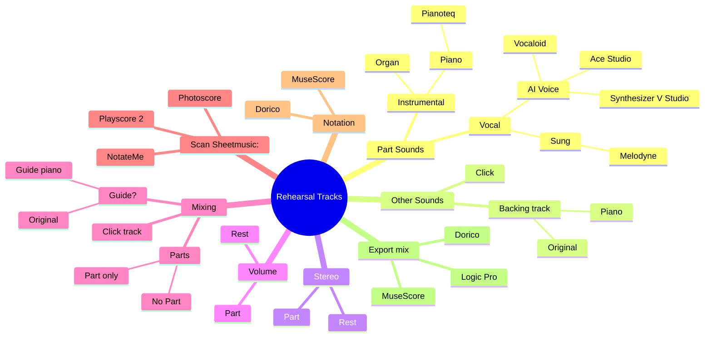

import YouTubeEmbed from '@site/src/components/YouTubeEmbed';

## Introduction

I have been creating choir rehearsal tracks since 2010 when I joined a mixed choir. Since I was a new singer I had a lot of "catching up" to do to learn the existing repertoire and this was when I started to combine my passion for music and computers. In 15 years technology has improved a lot to speedup and improve the process.

Here are the steps I take and the software I am using.
<!-- truncate -->

## Steps

### Scan the sheetmusic
  I am using [PlayScore 2](https://www.playscore.co): a sheetmusic scanning app

  It is no fun to manually type in all the notes, so I am using PlayScore 2 to help speedup the process. Most of the time I need to correct only some small things, but it really is an improvement from "long ago".

  I export musicxml from PlayScore 2 for the next step.

### Correct the notation 
  I am using [Dorico](https://www.steinberg.net/dorico/): a music notation program

  I use Dorico to perform any corrections after the sheetmusic is scanned. I have used other programs in the past, but Dorico's insert mode is really powerful to automatically shuffle music left and right as you insert or delete notes from a voice, or change the durations of notes.

  During this process I also regularly listen & read the sheetmusic to detect issues, e.g. missing note ties between pages, missing accidentals, etc.

  - I am using [Pianoteq](https://www.modartt.com/pianoteq_overview), a physically modeling based virtual piano.
    
    This virtual instrument can be configured in great detail and sounds amazing.

### Split the voice parts

  I also use Dorico to split the voice parts (e.g. when you have a reduced choir score with split female/male voices). Since I need to be able to playback each vocal part separately I use the "Paste Special, Explode into Staves" functionality.

  I export midi from Dorico for the next step.

### Generate part mixes 
  I am using [Logic Pro](https://www.apple.com/logic-pro/): a DAW

  While you can export audio from Dorico, I have choosen to do this from Logic because I am using my own mixing template that allows me to easily export different learning track mixes in one go.

  This mixing template is something that I want to explain in a future post, but in short it works this way:
  
  - open mixing template (containing input midi tracks for S1,S2,A1,A2,T1,T2,B1,B2, piano guide track)
  - import the midi as exported from Dorico
  - record enable the different mix tracks (per voice)
    - part track: single part is predominant, the other parts have a softer volume
    - part stereo track: same as part track, but the predominant part is mixed in stereo to one side and the other parts are on the other side
    - part only track: single part, other parts are not present
    - part with guide track: single part but including a piano (accompaniment)
  - play the whole song through once
  - bulk export the different mix tracks (to wav)
    
### Convert to MP3 
  I am using [Audacity](https://www.audacityteam.org): a free audio editor

  This is the last step and is mainly needed because I cannot bulk export to MP3 from Logic. I use the default "MP3 Conversion" Macro from Audacity to convert all the mixes (could be up to 32 wav files) in one go.

After this I shortly check all audio files and then make them available to the choir members.

## (optional step) vocal tracks

### Make AI vocal tracks 
  I am using [Synthesizer V Studio](https://dreamtonics.com/synthesizerv/): a vocal synthesizer

  At the end of 2023 I started experimenting with vocal synthesis to improve the rehearsal tracks with actual vocals. This is really promising, but still a bit time consuming to do from a lyric and finetuning point of view (which is also a great topic for a next post)

  Here is an example of a SynthV Choir cover:
  <YouTubeEmbed id="tk_hOnMwIII" />