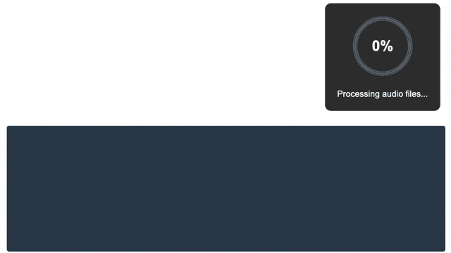

This post shows how to change the Emscripten TTY logic to get console output to determine the FFmpeg (WASM) encoding progress.



<!-- truncate -->

## Introduction

This is part of my work on creating a [Player for Learning Tracks](/blog/2025/03/23/multichannel-opus-player-proof-of-concept/index.md). 

Next to an actual player, I also need a way to encode the audio. Even though I used
the commandline version of FFmpeg locally to generate my first example file, I want something
with a bit more "GUI". Since the player is already web-based, why not do the encoder web-based too?

## FFmpeg WASM
And it turns out, there are several online projects for running FFmpegh in the browser (using WASM), I focused on the following two projects:

- [ffmpegwasm/ffmpeg.wasm](https://github.com/ffmpegwasm/ffmpeg.wasm), using FFmpeg n5.1.4<br/>
- [wide-video/ffmpeg-wasm](https://github.com/wide-video/ffmpeg-wasm), using FFmpeg 7.1.git<br/>


For `ffmpegwasm/ffmpeg.wasm` I ran into an [out of bounds issue with opus codec at 48kHz](https://github.com/ffmpegwasm/ffmpeg.wasm/issues/867). I tried upgrading to a newer version of FFmpeg, but that proved tricky due to [We cannot upgrade to n6.0 as ffmpeg bin only supports multithread at the moment.](https://github.com/ffmpegwasm/ffmpeg.wasm/issues/743).

That is when I looked for alternatives and found `wide-video/ffmpeg-wasm`, which was already on the latest version of FFmpeg.<br/>

The big difference is that this project is a more "pure" WASM port. While `ffmpegwasm/ffmpeg.wasm` has some additionaly customizations to provide it's own API around FFmpeg.

A side effect of the different approaches is that `wide-video/ffmpeg-wasm` has no integrated progress API.

## FFmpeg console

The FFmpeg tool prints relevant progress information on the console in the following format:

```txt
Input #0, aiff, from './data/shower-the-people/S.wav':
  Duration: 00:03:44.60, start: 0.000000, bitrate: 768 kb/s

Output #0, ogg, to './data/shower-the-people/minimal-output-stereo-pairs.opus':
size=   14665KiB time=00:03:44.59 bitrate= 534.9kbits/s speed=54.6x
```

### Input file(s)

The `Duration:` of each input files is printed to the console.<br/>
In order to determine how long the final encoded output will be, we just take the `max(Duration)` of all the inputs.

### Output file

The `time=` contains the currently encoded output progress.<br/>
However when testing capturing the console output of FFmpeg in the browser I only got progress at the end, but no intermediate progress.

This confused me a bit, until I started digging into the Emscripten generated TTY implementation

:::tip
- Carriage Return (CR) or ASCII 13: Represented as \r, moves the cursor to the beginning of the current line without advancing to the next line.

- Line Feed (LF) or ASCII 10: Represented as \n, moves the cursor down to the next line without affecting the horizontal position.
:::

## WASM TTY handling

This is the [default Emscription TTY handling](https://github.com/emscripten-core/emscripten/blob/main/src/lib/libtty.js):

```js
default_tty_ops: {
      // more ..
      put_char(tty, val) {
        if (val === null || 
            val === {{{ charCode('\n') }}}) {
          out(UTF8ArrayToString(tty.output)); // this will call "console.log" or custom "print" callback
          tty.output = [];
        } else {
          if (val != 0) tty.output.push(val);
        }
      }
      // more..
}
```


The issue in my case is that apparenly only the `Line Feed` will trigger a "log callback".<br/>
And FFmpeg is using the `Carriage Return` mechanism to have the progress update in place on the console output. It only does a `Line Feed` at the end of the program, when encoding is fully done.

Once I modified the code to also account for both `CR` and `LF` see below `val === {{{ charCode('\r') }}})`, it triggered the "log callback" during the encoding (as can be seen from the console output in the progess video at the start).

```js
      put_char(tty, val) {
        if (val === null || 
            val === {{{ charCode('\n') }}} || 
            val === {{{ charCode('\r') }}}) { // trigger on CR and LF
          out(UTF8ArrayToString(tty.output)); // this will call "console.log" or custom "print" callback
          tty.output = [];
        } else {
          if (val != 0) tty.output.push(val);
        }
      }
```

## Calculating progress

Now that we can capture the actual progress console output from FFmpeg we can calculate the encoding progress

### Input

The `parseFFmpegInputDuration` will parse a console log line and look for `Duration:` related information.<br/>
The maximum duration of all inputs will be stored and is used for the actual output progress calculation.

```js
  let totalDurationInSeconds = 0; // Set this to the total duration of your input file if known

  function extractTimeInSeconds(timeMatch) {
    if (timeMatch) {
      const timeStr = timeMatch[1];
      // Convert time string to seconds
      const timeParts = timeStr.split(/[:,\.]/);
      return parseInt(timeParts[0]) * 3600 + 
              parseInt(timeParts[1]) * 60 + 
              parseInt(timeParts[2]) + 
              parseFloat("0." + timeParts[3]);
    }
    return null;
  }

  function parseFFmpegInputDuration(line) {
    if (line.includes("Duration:")) {
      // Parse for full duration information
      //   Duration: 00:03:45.28, start: 0.000000, bitrate: 768 kb/s
      const durationMatch = line.match(/Duration: (\d+:\d+:\d+\.\d+)/);
      // keep the maximum detected duration
      if (durationMatch) {
        const durationInSeconds = extractTimeInSeconds(durationMatch);
        if (durationInSeconds > totalDurationInSeconds) {
            totalDurationInSeconds = durationInSeconds;
            console.log("Total Duration in seconds: " + totalDurationInSeconds);
        }
      }
    }
  }
```

### Output

The `parseFFmpegOutputProgress` will parse a console log line and look for the `time=` related information.<br/>
This will then be used to calculate the progressRatio in order to update the progress circle.

```js
  function parseFFmpegOutputProgress(line) {
    // Parse for progress information - FFmpeg typically outputs lines like:
    // frame=   54 fps=0.0 q=-0.0 size=     256kB time=00:00:02.16 bitrate= 968.9kbits/s speed=4.32x
    if (line.includes("time=") && line.includes("speed=")) {
      const timeMatch = line.match(/time=(\d+:\d+:\d+\.\d+)/);
      const timeInSeconds = extractTimeInSeconds(timeMatch);
      
      if (totalDurationInSeconds > 0 && timeInSeconds) {
          const progressRatio = Math.min(timeInSeconds / totalDurationInSeconds, 1);
          // callback to update updateProgressCircle(progressRatio);
      }
    }
  }
```

## Conclusion

The complete prototype code can be found at [japj/mcltp.ffmmpeg.wasm](https://github.com/japj/mcltp.ffmmpeg.wasm).

It includes some Docker scripts to build a minimal (audio only) version of FFmpeg.<br/>
It also uses [coi serviceworker](https://github.com/gzuidhof/coi-serviceworker) to ensure the FFmpeg WASM file can be used on GitHub Pages.