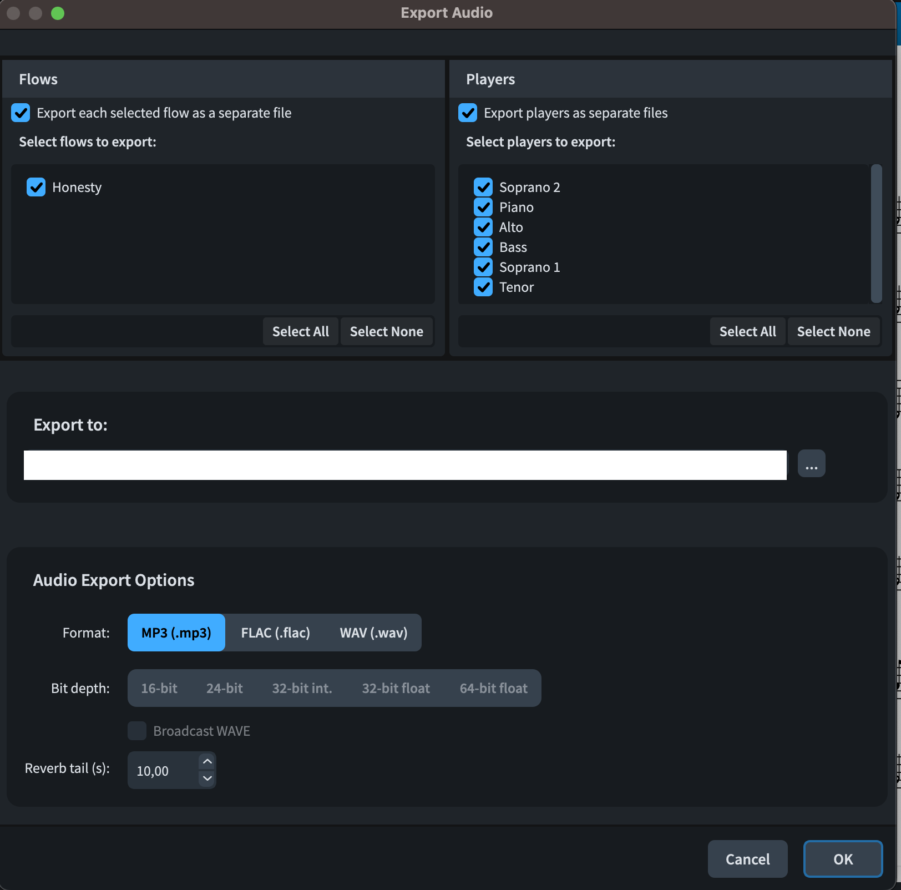

# Dorico

:::tip
The Dorico help pages have a whole section on [exporting audio files](https://www.steinberg.help/r/dorico-pro/5.1/en/dorico/topics/project_file_handling/project_file_handling_audio_exporting_t.html)
:::

## Default mixes
Dorico supports exporting the following default (types of) mixes:

- __Total__: This is the "Flow" to export
- __Part alone__: These are the seperate "Players" to export

:::tip
If you turn on the Metronome (Click) before exporting it will be included in the audio files.
:::

Dorico will use whatever sound you have setup for the different parts in the export.
If you do not like the build-in choir (ah) sounds you can choose to use a different sound for playback.

:::note
Choosing sounds is a topic that I want to write about in another section of this guide.
:::