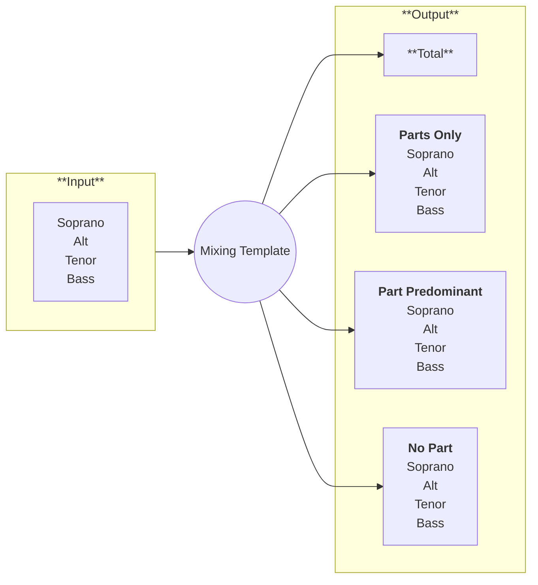

# Mix Template Concept

With a mixing template you can save time by preparing the different mixes that you want to have once and then use that each time you need to create new learning tracks. 

```mermaid
flowchart LR

    subgraph Input["**Input**"]
    I["`
    Soprano
    Alt
    Tenor
    Bass`"]
    end

    Input --> Mix
 
    Mix(("Mixing Template"))
   
    subgraph Output["**Output**"]

    Total

    PartsOnly["`**Parts Only**
    Soprano
    Alt
    Tenor
    Bass`"]


    Predominant["`**Part Predominant**
    Soprano
    Alt
    Tenor
    Bass`"]


    NoPart["`**No Part**
    Soprano
    Alt
    Tenor
    Bass`"]

    end

    Mix --> Total["**Total**"]
    Mix --> NoPart
    Mix --> Predominant
    Mix --> PartsOnly

```