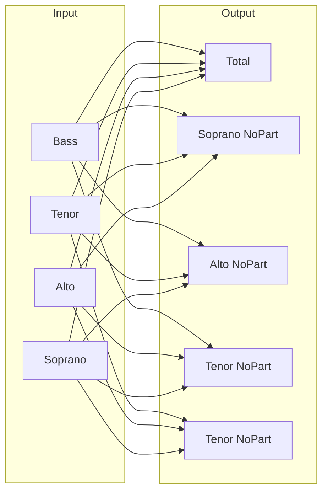
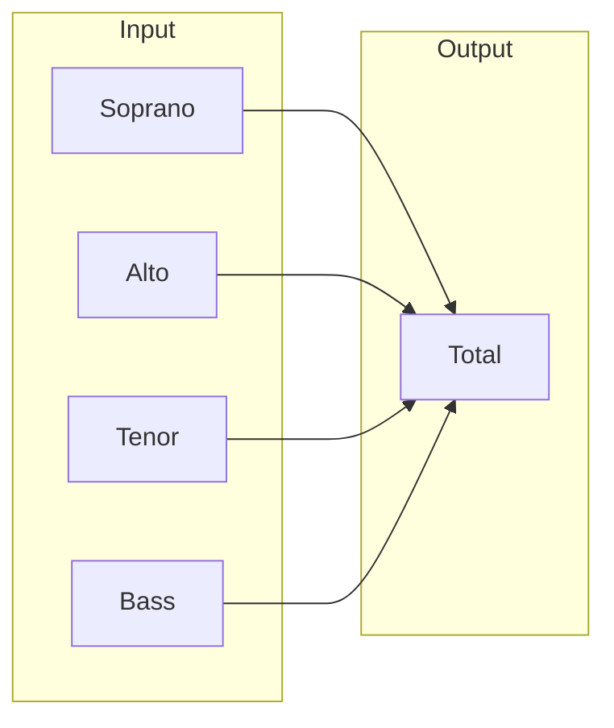
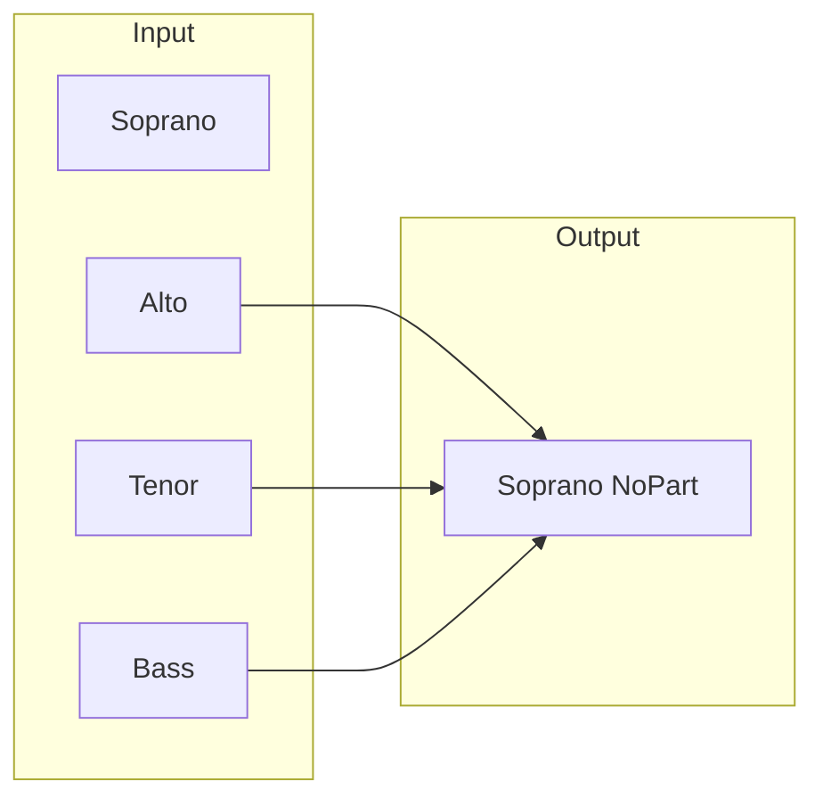
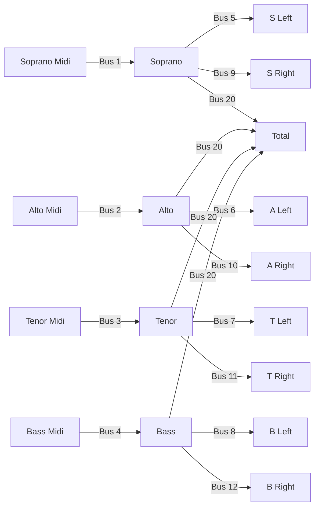

# SATB

Input Bus|Name
---|---
1|Soprano
2|Alto
3|Tenor
4|Bass

:::note
Stereo Bus setup not needed if Part mix is not stereo
:::

Stereo Bus|Name
---|---
5|Soprano Left
6|Alto Left
7|Tenor Left
8|Bass Left
9|Soprano Right
10|Alto Right
11|Tenor Right
12|Bass Right

Output Bus|Name
---|---
20|Total
21|Soprano Part Predominant
22|Alto Part Predominant
23|Tenor Part Predominant
24|Bass Part Predominant
25|Soprano Part Only
26|Alto Part Only
27|Tenor Part Only
28|Bass Part Only
29|Soprano No Part
30|Alto No Part
31|Tenor No Part
32|Bass No Part

Working backwards

bla

