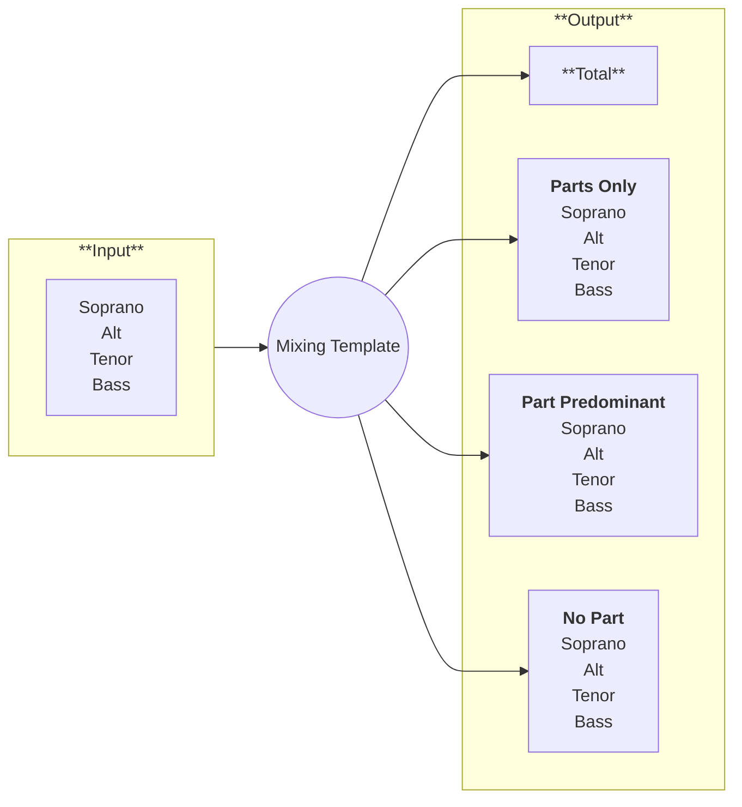

# What is a mixing template

With a mixing template you can save time by preparing the different mixes that you want to have once and then use that each time you need to create new learning tracks. 

A mixing template can be setup in a DAW and consists out of 3 parts:

- Input Tracks

  These are the original midi, or (vocal) audio tracks that you generated before.

- Output Tracks

  These will contain the different mixes you want to export.

- The mixing template

  This uses the DAW "bus" concept to send the Input Track audio to the different mixes in various forms (e.g. left/right stereo, soft/normal volume).

Then the process of creating a new mix is:

- Open the template (save it as a new song)
- Import the midi (or audio files) and put them on the right Input Track
- Record enable the Output Tracks
- Play through the whole song once
- Export the Output Tracks

And then you can share the Output Tracks with your choir.

:::note
I have personally used Logic Pro to setup a mixing template and will later show how this can be done.

But the concept is not limited to Logic Pro.
:::