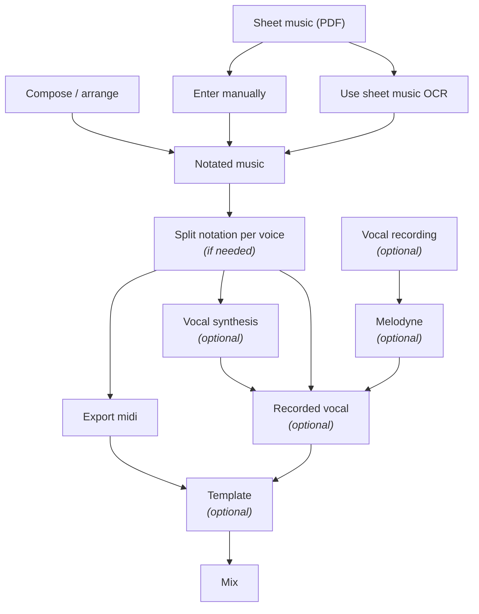

# Overview

Creating Vocal Learning Tracks consists of different steps.

You do not need to use all steps, but this guide will try to explain different options so you can find the information that is relevant to you.

Below is an overview of the different options.

If you are already Creating Vocal Learning Tracks then you might have a workflow like:

- Sheet music (PDF)
- Enter manually in Notation program
- Export (mixed) Audio from the Notation program

And doing it this way is perfectly fine, but...

Depending on how often you Create Vocal Learning Tracks and whether you want different sounds (or sung vocals)
then you might want to look at ways of improving your workflow.

Hopefully this guide can help you along the way.

:::tip
SheetMusic recognition technology has improved a lot through the years. 
If you have tried it (long ago) in the past and discarded it then I encourage you try again since it can save a lot of time!

I start Creating Vocal Learning Tracks in 2010 and manually typed everything by hand, but haven't done that since several years.
:::